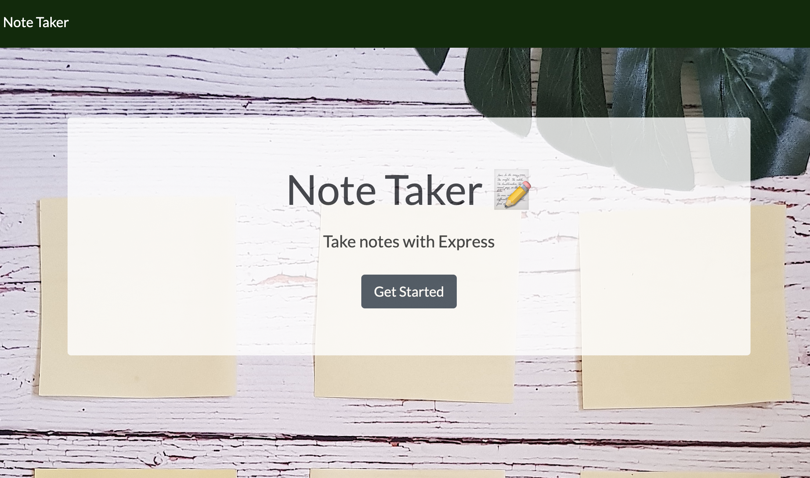
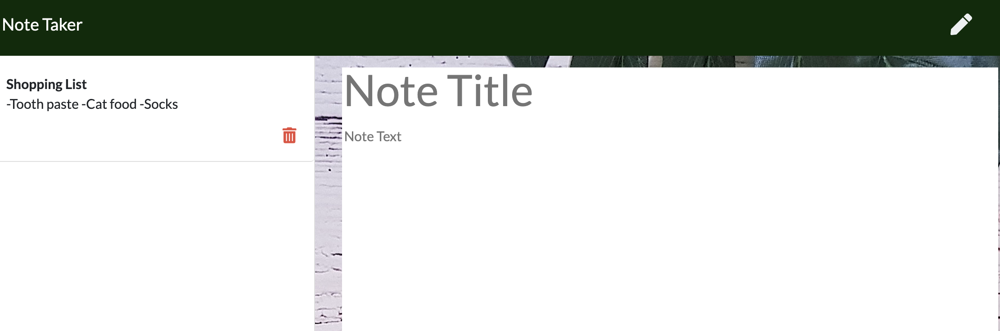
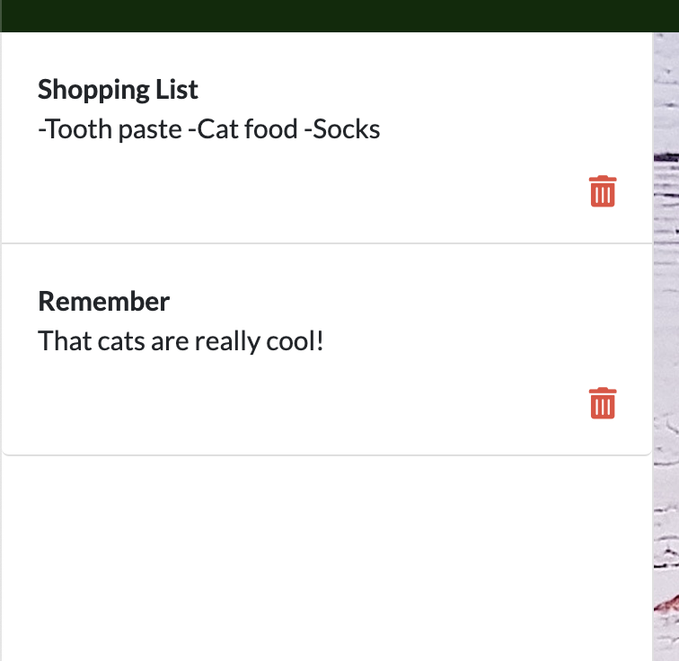

# Note-Taker
A note taking application that allows a user to write to, save, and delete notes.
https://safe-lake-34410.herokuapp.com/
## User Story
As a student and full time employee, it is important to take notes through the day, so that I can go back to my ideas, grocery lists, etc. when I have the time.

## Usage 
On the home page, there is a "Get Started" button that redirects the used to the note taking page. 

#### Write
From this page, a user can write, save, and delete notes!

#### Save
Jot down items in a note for grocery shoppping after work!

Or take down notes to remind yourself about a phone call you have to make later!

#### Delete
Once you no longer need the note, go ahead an click on the trash can to delete it.

## Programming Languages Used
* HTML
* CSS
* Javascript

### Additional Styling Framework 
* Bootstrap | https://getbootstrap.com/
* Fontsawesome icons | https://fontawesome.com/icons?d=gallery&m=free
